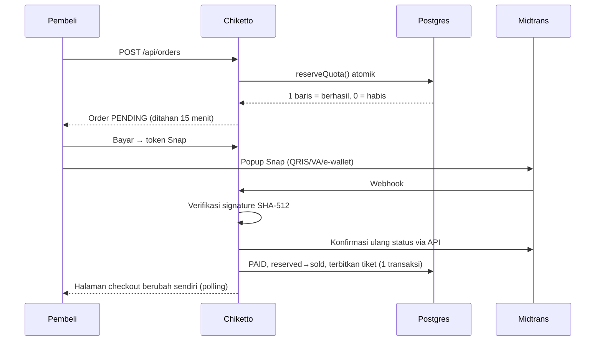

# Chiketto

**Chiketto** (チケット, "tiket") adalah platform tiket event kampus. Himpunan, UKM, dan BEM membuat event dan menjual tiket, mahasiswa membeli lalu menyimpan e-tiket QR, dan panitia memindai tiket di pintu masuk.

Chiketto menggantikan alur Google Form + transfer manual + cek bukti bayar. Pembayaran terverifikasi otomatis lewat webhook, e-tiket terbit sendiri, dan check-in cukup sekali pindai.

> Dibangun dari dua dokumen: `chiketto-rancangan-sistem.md` (rancangan sistem) dan `chiketto-design.md` (sistem desain). Token desainnya ada di [`app/tokens.css`](app/tokens.css).

## Fitur

| Peran | Yang bisa dilakukan |
|---|---|
| Pembeli | Melihat papan jadwal event, filter & cari, beli tiket (Midtrans Snap atau gratis), Tiket Saya yang bisa dibuka offline, unduh e-tiket PDF, verifikasi email kampus untuk harga mahasiswa |
| Penyelenggara | Membuat event (draft → terbit), jenis tiket (harga, kuota, periode jual, khusus mahasiswa), dashboard penjualan, daftar peserta + unduh Excel/CSV, undang panitia |
| Panitia | Scanner QR di HP dengan empat hasil (Valid, Sudah masuk, Event lain, Tidak dikenal), getar berbeda per hasil, input kode manual |
| Admin platform | Verifikasi organisasi, nonaktifkan event bermasalah |

## Menjalankan secara lokal

Kebutuhan: Node.js 20+, Docker.

```bash
cp .env.example .env            # lalu isi AUTH_SECRET dan QR_SECRET
docker compose up -d            # Postgres, Redis, Mailpit
npm install
npm run db:deploy               # terapkan migrasi
npm run db:seed                 # data demo (MENGHAPUS data yang ada)
npm run dev                     # http://localhost:3100
npm run worker                  # terminal lain: email e-tiket & job expire-orders
```

- Email (magic link, e-tiket, kode verifikasi) tertangkap di Mailpit: <http://localhost:8025>.
- Tanpa kunci Midtrans dan dengan `PAYMENT_MOCK=true`, tombol **Bayar** di checkout menyimulasikan notifikasi `settlement` lewat jalur kode yang sama dengan webhook asli. Mode ini mati otomatis di produksi.

### Akun demo (`DEMO_LOGIN=true`)

| Peran | Email |
|---|---|
| Pembeli (mahasiswa terverifikasi) | `pembeli@demo.chiketto.id` |
| Penyelenggara (HIMA SI, BEM FT, UKM Seni Rupa) | `penyelenggara@demo.chiketto.id` |
| Panitia (scanner Malam Akustik) | `panitia@demo.chiketto.id` |
| Admin platform | `admin@demo.chiketto.id` (masuk lewat magic link) |

Halaman `/masuk` menampilkan tombol masuk langsung untuk tiga peran pertama. Semua angka penjualan di data demo berasal dari order dan tiket yang benar-benar dibuat oleh `prisma/seed.ts`.

## Alur checkout & pembayaran



Status lunas **hanya** ditentukan dari webhook yang terverifikasi, tidak pernah dari redirect browser.

## Anti-rebutan kuota

Setiap jenis tiket menyimpan `quota`, `reserved`, dan `sold`. Kuota ditahan dengan satu `UPDATE` bersyarat ([`lib/orders/reserve-quota.ts`](lib/orders/reserve-quota.ts)):

```sql
UPDATE "TicketType" SET "reserved" = "reserved" + $qty
WHERE "id" = $id
  AND "sold" + "reserved" + $qty <= "quota"
  AND now() BETWEEN "salesStart" AND "salesEnd"
```

Postgres mengunci baris dan mengevaluasi ulang kondisi `WHERE` setelah lock dilepas, sehingga 50 checkout serentak untuk kuota 10 menghasilkan tepat 10 order. Tidak ada pola "baca dulu, tulis kemudian" yang bisa kalah balapan.

Lapisan lain yang menjaga konsistensi:

| Kasus | Penanganan |
|---|---|
| Klik ganda dari akun yang sama | Baris `User` dikunci `FOR UPDATE` selama transaksi, lalu batas beli per akun dihitung ulang |
| Webhook terkirim berkali-kali | Baris `Order` dikunci `FOR UPDATE`; order yang sudah `PAID` tidak menerbitkan tiket lagi; `Payment.gatewayRef` unik |
| Order kedaluwarsa bersamaan dengan webhook lunas | Transisi bersyarat `WHERE status = 'PENDING'`: hanya satu yang menang |
| Bayar setelah kuota dilepas | Coba tahan ulang; jika sudah habis, dicatat `order.paid_without_quota` untuk refund manual |
| Dua panitia memindai tiket sama | `UPDATE ... WHERE checkedInAt IS NULL`: hanya satu yang mendapat **Valid** |

Semua kasus di atas punya tes integrasi dengan Postgres asli di [`tests/integration`](tests/integration).

## QR yang aman

Isi QR bukan ID tiket, melainkan token bertanda tangan `base64url(ticketId).base64url(HMAC-SHA256(ticketId, QR_SECRET))`. Server menolak QR palsu sebelum menyentuh database. Screenshot QR hanya bisa dipakai sekali karena status check-in dicek di server. Kode pendek (`K7M-2QX`) untuk input manual memakai alfabet tanpa O/0/I/1.

## Tes

```bash
npm test                    # unit: format Rupiah, token QR, total & batas beli, signature Midtrans
npm run test:integration    # butuh Postgres (TEST_DATABASE_URL); tabel dikosongkan per tes
npm run test:e2e            # Playwright, butuh DB yang sudah di-seed
```

## Struktur

```
app/(public)/          beranda (papan jadwal), detail event, checkout, Tiket Saya, masuk
app/dashboard/         dashboard penyelenggara (Server Actions + Zod)
app/scan/              scanner panitia
app/admin/             admin platform
app/api/               route handler publik, pembeli, penyelenggara, panitia, webhook
lib/orders/            create-order, reserve-quota, handle-payment, release-order, issue-tickets
lib/                   auth, permissions, midtrans, qr-token, checkin, events, email, queue
worker/                BullMQ: expire-orders (tiap menit), send-ticket-email
emails/ pdf/           React Email & @react-pdf/renderer
prisma/                schema, migrasi, seed
```

## Deploy

| Bagian | Layanan |
|---|---|
| App | Vercel (`npm run build`) |
| Postgres | Neon (`DATABASE_URL`) |
| Redis | Upstash (`REDIS_URL`, protokol `rediss://`) |
| Worker | Railway/Render: `npm run worker` |
| Email | Resend (`RESEND_API_KEY`) |
| Poster | Cloudinary (tanpa Cloudinary, poster disimpan di `.uploads/`, cocok untuk lokal saja) |

Set URL notifikasi Midtrans ke `https://<domain>/api/webhooks/midtrans`, dan matikan `DEMO_LOGIN` serta `PAYMENT_MOCK` di lingkungan produksi sungguhan.
